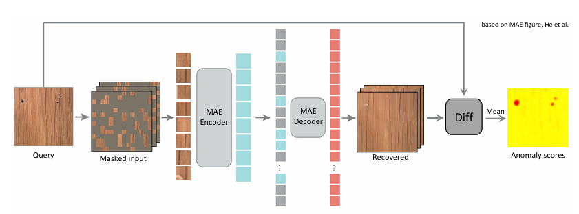

# MAEDAY
Unofficial reimplementation of "MAEDAY: MAE for few and zero shot AnomalY-Detection". You can view the original paper from [here](https://arxiv.org/abs/2211.14307).
An other unofficial reimplementation of the paper can be found [here](https://github.com/HuWeiYu/MAEDAY-pytorch). But this repository doesn't produce the same results as the original paper🙁. 



We try to reproduce the results of the original paper. Some of the details of the original paper are not clear, plase note following points:
- The original paper uses "MAE", but the specific type of model architecture is not mentioned. So, we use the "ViT-B/16" for default model architecture.
- The original paper employ LoRA fine-tuning, but they don't mention the details of the LoRA fine-tuning (e.g., what part of the model is updated). We apply LoRA fine-tuning to the whole model. (Plase note the performance gap between LoRA and full fine-tuning is small!)
- The original paper doesn't provide the information about creating random masks which efficiently cover the whole image. We use the same mask generation method as the MAE paper (i.e., mask 75% of patches from uniform distribution).

Additionaly, we provide the following features:
1. Additional Datasets: MVTecLOCO for evaluating the capability of the model to detect logical anomalies.
2. Number of Samples: You can specify the number of samples for few-shot learning (e.g., you can fine-tune model on all normal samples).
3. Batch Inferences: You can perform inference for N different masks at once. 

If you interested in the anomaly detection with masked image modeling, plase check our recent work [here](). Compared to the MAEDAY, our method improves by ⚠️% on MVTecAD and ⚠️% on MVTecLOCO.

## Installation
For installation, run the following commands:
```bash
git clone https://github.com/TSTB-dev/MAEDAY.git
cd MAEDAY
pip install -r requirements.txt
```

### Usage
---
⬇️Install pre-trained weights 
```bash
bash scripts/download_weights.sh
```
After installing the weights, you can see the weighs has been installed at the `weights` directory.

⬇️Download the dataset
```
bash scripts/download_dataset.sh
```
After installing the dataset, you can see the dataset has been installed at the `data` directory.


### Experiment Results
---


